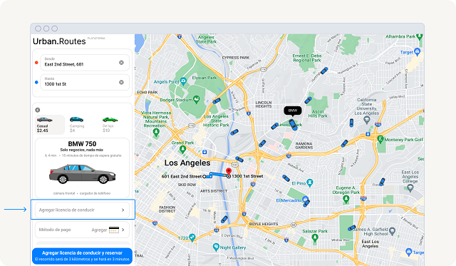
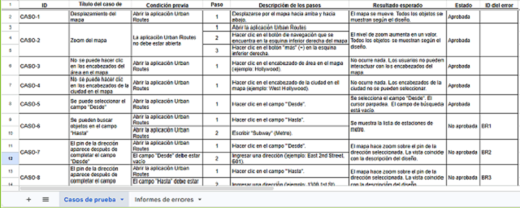
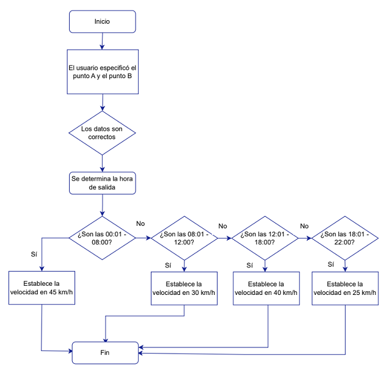

# QA - Proyecto de testing aplicación Web Urban Routes

Una plataforma de movilidad que permite crear rutas, calcular la duración y el costo de los viajes según diferentes tipos de transporte.  

  

Este repositorio documenta la evidencia de las pruebas realizadas a la aplicación dentro del portafolio de QA.

## 📋 Módulos Probados (Sprints)

### ☑️ **Sprint 1: Fundamentos de pruebas funcionales y flujo de trabajo de la documentación**

<strong>Objetivo Proyecto 1:</strong> Realizar pruebas de regresión para validar funcionalidades críticas como selección de transporte e interfaz de usuario después de una actualización del sistema.

- `Marcela Collazos M, 53.grupo - 1er sprint.xlsx`

<strong>Análisis:</strong> Apliqué técnica de testing funcional y de regresión, diseñando casos de pruebas basados en los requisitos principales.

  

Utilicé Excel para documentar sistemáticamente 24 casos de prueba cubriendo funcionalidades críticas como geolocalización, formularios de entrada y navegación. Realicé pruebas de interfaz de usuario y validación de datos.

  

<strong>Conclusión:</strong> Identifiqué 8 defectos críticos relacionados con validación de campos del formulario y precisión de la geolocalización en el mapa.

Este proyecto fortaleció mis habilidades en documentación estructurada de casos de prueba y reporte detallado de bugs.

### ☑️  Sprint 2: Análisis de requisitos y Diseño de pruebas

<strong>Objetivo Proyecto 2:</strong> Diseñar pruebas de manera sistemática a partir del planteamiento de los requisitos de la aplicación

- `Marcela Collazos M, 53.grupo - 2.o sprint.xlsx`
- `Diagrama flujo velocidad del automóvil compartido.drawio.pdf`
- `Mapa mental función Agregar licencia.drawio.pdf`

<strong>Análisis:</strong> Se realizó revisión de los requisitos de la función "Compartir automóvil", incluyendo el formulario de "Agregar licencia de conducir" y el sistema de cálculo de precio. Además, de aplicación de tecnicas de diseño de pruebas para identificar clases de equivalencia y valores límite en campos críticos como "Nombre", "Apellido" y parametros de cálculo.

  

Utilicé Drawio para creación de documentación visual mediante mapas mentales y diagramas de flujo para representar la lógica del sistema

<strong>Conclusión:</strong> Identifiqué clases de equivalencias repetidas que permitieron reducir el número de casos de prueba necesarios en un 24% mientras mantenía la cobertura completa.

Este proyecto fortaleció mis habilidades en analisis de algoritmos para entender la lógica de negocio, validación de cálculos y procesos automátizados. Además de, organización visual de datos complejos y simplificación de conceptos técnicos.

### ☑️  Sprint 3: Pruebas de Aplicaciones Web y Testing Cross-Browser

<strong>Objetivo Proyecto 3:</strong> Realizar pruebas completas de interfaz, entre plataformas y navegadores y pruebas de adaptabilidad del diseño.

- `Marcela Collazos M, 53.grupo - 3er. sprint.xlsx`

<strong>Análisis:</strong> Realicé pruebas exhaustivas en dos configuraciones específicas: Google Chrome (800x600) y Firfox (1920x1080), cubriendo desde la validación visual del diseño hasta la funcionalidad completa del flujo de reserva de vehículos.

Utilicé Excel para documentar sistemáticamente los listados de comprobación de "Pruebas de diseño" y prueba de las ventanas "Método de pago" y "Agregar tarjeta". Además, de los casos de prueba para la lógica y las funciones del botón "Reserva".

- Ejecuté más de  50 casos de prueba individuales cubriendo diseño, funcionalidad y compatibilidad.

- Identifiqué y reporté 18 defectos en los listados de comprobación y 2 casos de prueba críticos en Jira.
  
- Logré el 95% de cobertura en las funcionalidades críticas.  

<strong>Conclusión:</strong> Dominé el uso de Jira para reporte profesional de defectos con evidencia visual completa.

Este proyecto fortaleció mis habilidades en testing cross-browser y analisis de compactibilidad responsive.

